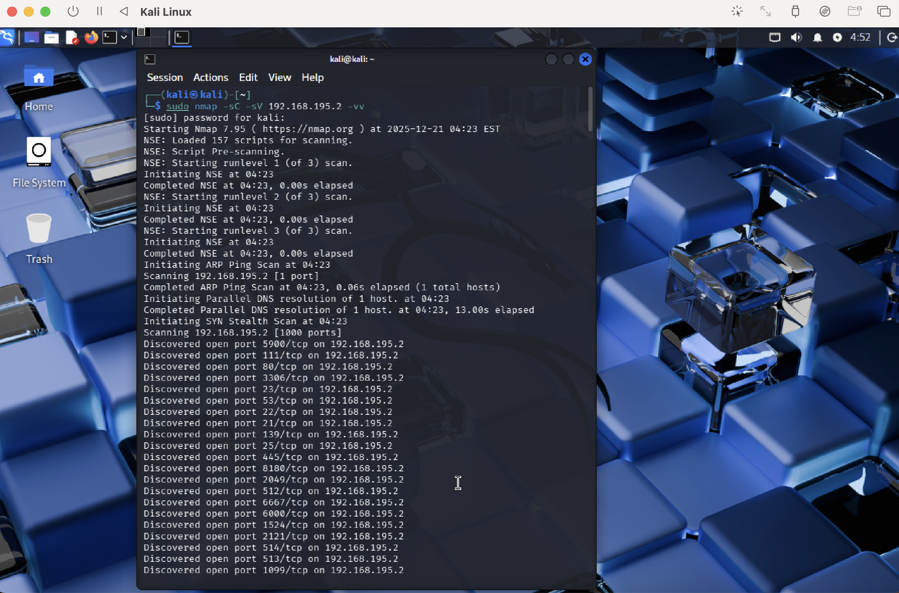
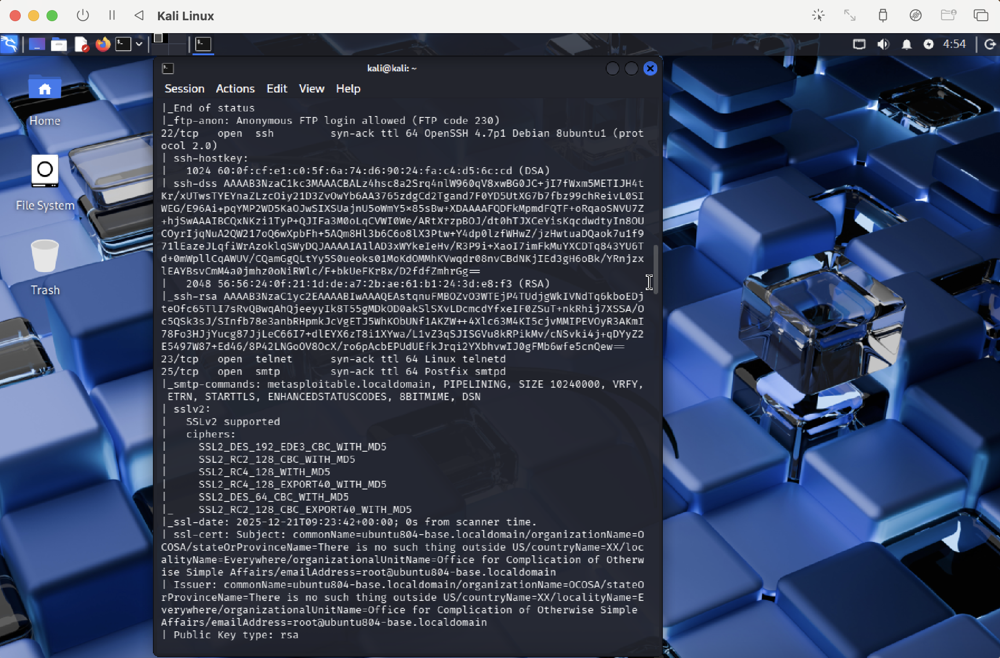
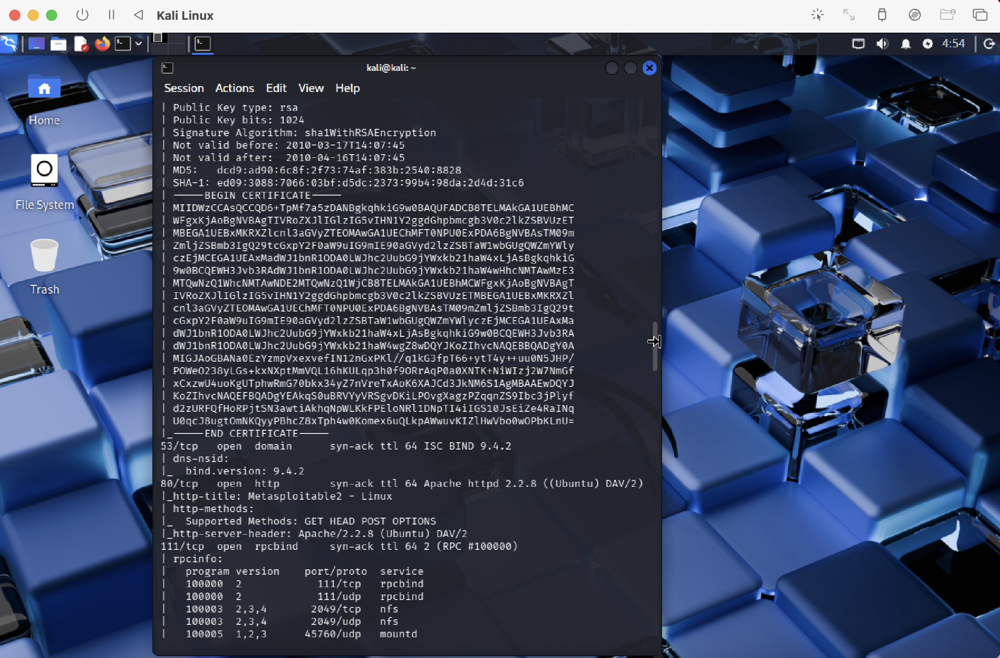
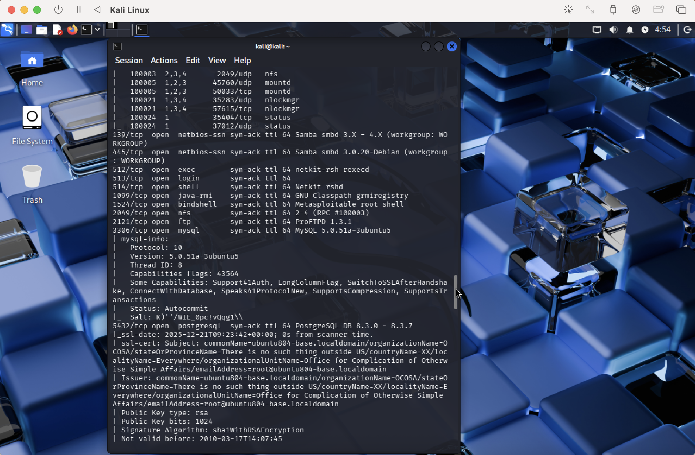

# 🔎 Nmap Reconnaissance & Enumeration Lab

## 👨‍💻 Author

Sabrina Major

---

## 🎯 Objective

The goal of this lab was to perform network reconnaissance against a vulnerable system to identify open ports, running services, and potential security risks.

---

## 🛠 Tools Used

* Kali Linux
* Nmap
* Metasploitable2

---

## 🌐 Lab Environment

* Attacker Machine: Kali Linux
* Target Machine: Metasploitable2
* Network: Local Virtual Network

---

## ⚙️ Methodology

### 1. Connectivity Test

```bash
ping <target-ip>
```

---

### 2. Nmap Scan

```bash
nmap -sC -sV -vv <target-ip>
```

---

### 3. Enumeration

* Identified open ports
* Detected running services
* Collected version information

---

## 🔍 Screenshots & Evidence

### 1. Initial Nmap Scan Command Execution



This screenshot shows the execution of the Nmap command used to initiate the scan against the target system. The flags `-sC` and `-sV` enable default script scanning and service version detection, which are critical for identifying potential vulnerabilities.



The Nmap scan revealed that SSH (Secure Shell) is running on port 22. SSH is commonly used for secure remote access to systems, making it a critical service to analyze during reconnaissance.

The scan also identified the specific version of OpenSSH running on the target system. Version detection is important because outdated or vulnerable versions may be exploited by attackers.

This step demonstrates how attackers move from simply identifying open ports to understanding what services are running and whether they present security risks.



This screenshot shows the identification of a web server running on port 80. The Nmap scan detected Apache HTTP Server along with additional details such as supported HTTP methods and server headers.

Web servers are one of the most common attack surfaces in real-world environments. Identifying the web service and its version allows security analysts to assess potential vulnerabilities, such as outdated software or misconfigurations that could be exploited.



This screenshot shows database services detected on the target system, including MySQL on port 3306 and PostgreSQL on port 5432. These services indicate that the system is running backend databases that may store sensitive information.

Exposed database services present significant security risks, especially if they are accessible without proper authentication or are running outdated versions. Attackers often target these services to extract data or gain deeper access into the system.


---

## 🔍 Key Findings

* FTP (Port 21) → Anonymous login enabled
* SSH (Port 22) → Outdated version
* Telnet (Port 23) → Insecure protocol
* HTTP (Port 80) → Apache server
* MySQL (Port 3306) → Database exposed

---

## ⚠️ Security Observations

* Multiple outdated services
* Weak authentication mechanisms
* High attack surface

---

## 🛡️ SOC Analyst Perspective

This type of scan would generate:

* IDS alerts for port scanning
* Firewall logs showing repeated connection attempts
* Suspicious traffic patterns

---

## 📸 Screenshots

(Add your screenshots later)

---

## 📚 Skills Gained

* Network reconnaissance
* Service enumeration
* Vulnerability identification
* Threat awareness

---

## 🧠 What I Learned

This lab showed how attackers can quickly gather valuable information about a system. Even without exploiting anything, identifying open ports and services provides a roadmap for potential attacks.

---
