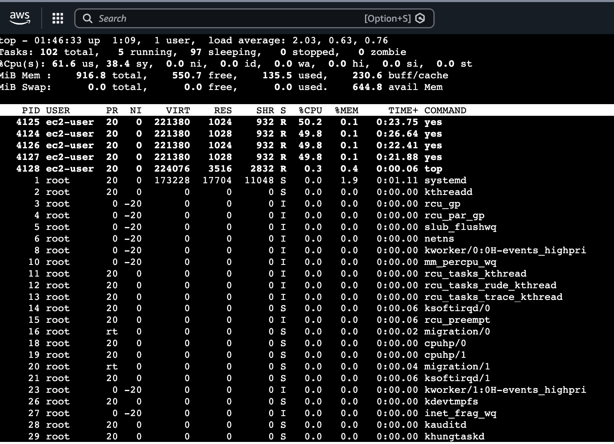
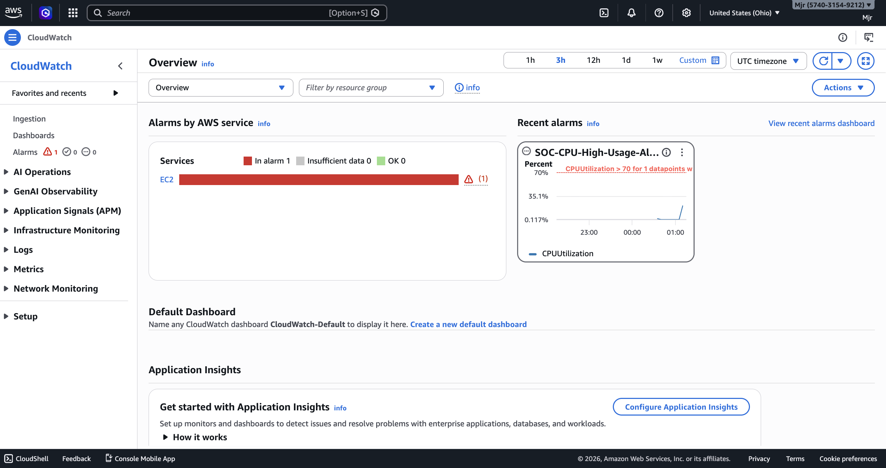
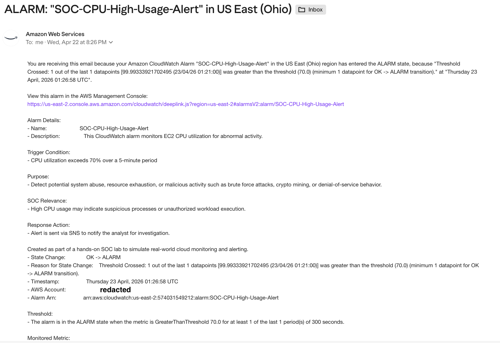
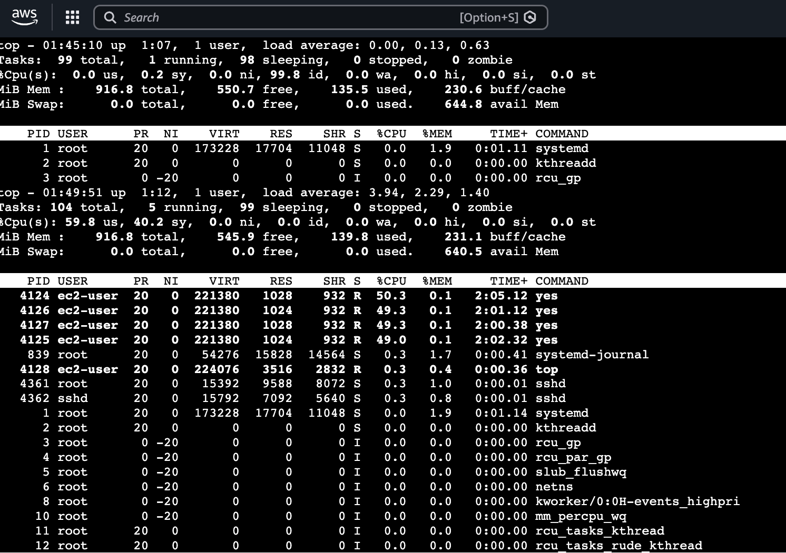
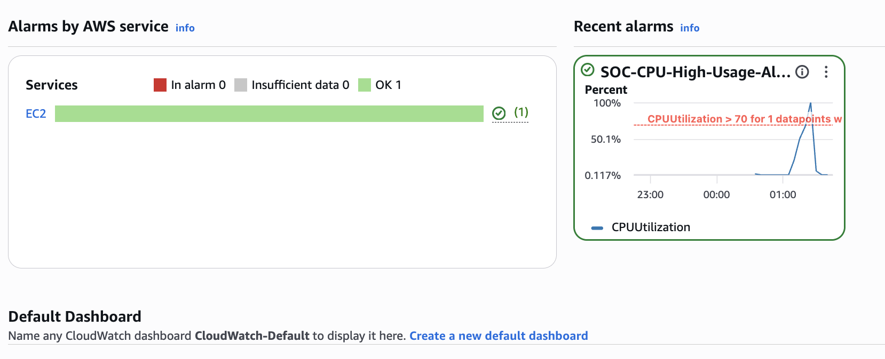

# ☁️ AWS SOC Lab: CloudWatch CPU Alert Detection & Response

## 📌 Overview
In this lab, I simulated suspicious system activity on an AWS EC2 instance and configured Amazon CloudWatch to detect and alert on abnormal CPU usage.

This project demonstrates how SOC analysts monitor cloud infrastructure, detect anomalies, and respond to potential threats in real time.

---

## 🎯 Objectives
- Deploy an EC2 instance (Free Tier)
- Simulate high CPU usage (potential attack behavior)
- Configure CloudWatch alarm for detection
- Trigger alert and receive SNS email notification
- Respond and return system to normal state

---

## 🛠️ Tools & Services
- AWS EC2 (t3.micro)
- AWS CloudWatch
- AWS SNS (Email Alerts)
- Linux CLI (`top`, `yes`, `pkill`)

---

## ⚙️ Alarm Configuration
- **Metric:** CPUUtilization  
- **Threshold:** > 70%  
- **Period:** 5 minutes  
- **Evaluation:** 1 datapoint  
- **Notification:** SNS Email  

---

## 🚨 Attack Simulation (High CPU)

📸 High CPU Usage Detected  


**What this shows:**
- Multiple `yes` processes consuming CPU
- CPU utilization spikes close to 100%
- Simulates resource abuse (crypto mining / DoS behavior)

---

## 🔴 Detection Phase (Alarm Triggered)

📸 CloudWatch Alarm Triggered  


**What this shows:**
- Alarm state changed from **OK → ALARM**
- CPU exceeded defined threshold
- Detection of abnormal system activity

---

## 📧 Alert Notification

📸 SNS Email Alert Received  


**What this shows:**
- Real-time alert sent to analyst
- Includes:
  - Alarm name
  - Threshold breach details
  - Timestamp
- Simulates SOC alerting workflow

---

## 🛑 Response Phase (Mitigation)

📸 CPU Usage Dropping After Response and Recovery Phase (System Stabilized)

 


**Action Taken:**
```bash
pkill yes

## What this shows:
Malicious/suspicious processes terminated
CPU usage begins returning to normal

🟢 Recovery Phase (System Stabilized)

📸 CloudWatch Alarm Returned to OK
What this shows:

Alarm state changed from ALARM → OK
System stabilized after response
Monitoring confirms resolution

🧠 SOC Analysis

🔍 What Happened
Sudden spike in CPU usage triggered alert
Behavior consistent with:
Resource exhaustion attack
Cryptomining activity
Misconfigured processes

🚨 Why It Matters
High CPU usage can indicate:

Compromised systems
Unauthorized workloads
Performance degradation

🛡️ Response Actions
Identified abnormal processes
Terminated malicious activity
Verified system recovery through monitoring

📚 Key Takeaways
CloudWatch provides real-time detection of system anomalies
Alerts allow rapid SOC response
Monitoring + response = critical for cloud security
Even simple metrics (CPU) can reveal threats

🚀 Future Improvements
Add memory and network monitoring alerts
Integrate AWS GuardDuty for threat intelligence
Forward logs to a SIEM (Splunk / ELK)
Automate response using AWS Lambda

🏁 Conclusion
This lab simulates a real-world SOC scenario where abnormal system activity is detected, investigated, and resolved using AWS monitoring tools.
It demonstrates foundational cloud security skills required for a SOC Analyst role.
