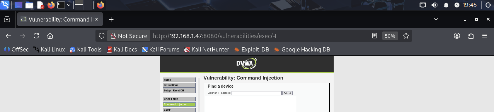

# 🕸 DVWA Web Application Exploitation Lab  

## 👨‍💻 Author  
Sabrina Major  

---

## 🎯 Objective  
The goal of this lab was to identify and exploit common web application vulnerabilities using DVWA (Damn Vulnerable Web Application) in a controlled environment.

---

## 🔍 Screenshots & Evidence  

### 1. DVWA Access & Setup  

This screenshot shows successful access to the DVWA web application. DVWA is a deliberately vulnerable application used to practice web exploitation techniques.

Gaining access to the application is the first step in testing for vulnerabilities, as it confirms that the target system is reachable and ready for analysis.
