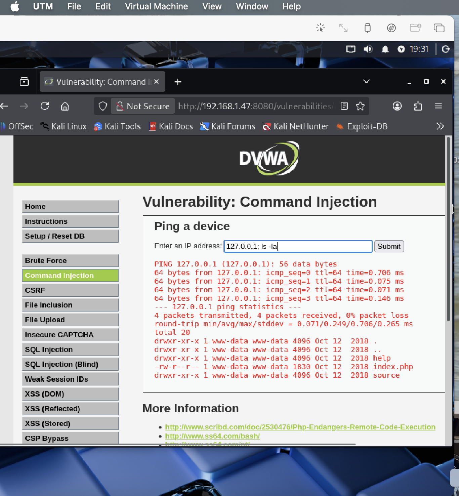
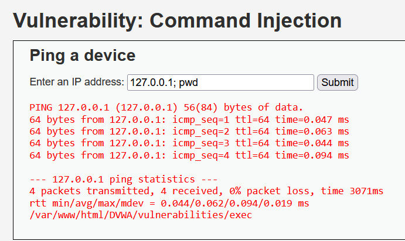

# 🕸 DVWA Web Application Exploitation Lab  

## 👨‍💻 Author  
Sabrina Major  

---

## 🎯 Objective  
The goal of this lab was to identify and exploit common web application vulnerabilities using DVWA (Damn Vulnerable Web Application) in a controlled environment.

---

## 🔍 Screenshots & Evidence  
  
---

## 🔥 DVWA Lab – Command Injection

🧠 Overview

In this lab, I demonstrated a Command Injection vulnerability using the Damn Vulnerable Web Application (DVWA). The goal was to test whether user input was properly sanitized before being executed by the system.

🎯 Objective
Identify input fields vulnerable to command injection
Execute system-level commands through the web interface
Verify access to the underlying operating system
🛠️ Environment
Kali Linux (Attacker Machine)
Metasploitable2 (Target)
DVWA running on Apache (Port 8080)
Browser-based interaction
🚀 Attack Execution

---

Step 1 - DVWA Access & Setup

I accessed the DVWA web application through the browser using the target machine’s IP address. DVWA is a deliberately vulnerable application used to practice web exploitation techniques.

Gaining access to the application is the first step in testing for vulnerabilities, as it confirms that the target system is reachable and ready for analysis.

📸 Evidence:

Step 2 – Identify Vulnerable Input

The “Ping a device” feature accepts user input and executes it on the backend system.

Step 3 – Test for Injection

I entered:

127.0.0.1

✔️ This confirmed normal functionality.

Step 4 – Exploit the Vulnerability

I injected additional commands using ;

Example payload:

127.0.0.1; ls -la

📸 Evidence:

Step 5 – Confirm System Access

I executed:

127.0.0.1; pwd

📸 Evidence:

✔️ Output revealed:

/var/www/html/DVWA/vulnerabilities/exec
💥 Impact

This vulnerability allows:

Remote command execution (RCE)
Unauthorized access to system files
Full compromise of the web server
Potential privilege escalation
🛡️ Mitigation

To prevent command injection:

Sanitize all user input
Avoid directly passing input to system commands
Use parameterized functions instead of shell execution
Implement input validation and allowlists

🧠 Key Takeaways:
User input should never be trusted
Simple characters like ; can break application security
Command injection can lead to full system compromise

💉 DVWA Lab – SQL Injection
🧠 Overview

In this lab, I exploited a SQL Injection vulnerability in DVWA by manipulating user input to interact directly with the backend MySQL database.

🎯 Objective
Identify SQL injection points
Extract database information
Retrieve sensitive user data
🛠️ Environment
Kali Linux (Attacker)
Metasploitable2 (Target)
DVWA (Web Application)
MySQL Database
🚀 Attack Execution
Step 1 – Access SQL Injection Page

📸 Evidence:

I navigated to the SQL Injection module, where user input is directly used in a backend SQL query without proper sanitization.

Step 2 – Identify Injection Vulnerability

Test payload:

1'

✔ Result:

Application behavior changes, confirming improper input handling
Indicates potential SQL injection vulnerability
Step 3 – Extract Database Name

Payload:

1' UNION SELECT database(),2-- -

📸 Evidence:

✔ Result:

The database name dvwa was returned

🧠 Explanation:

UNION SELECT allows combining results from another query
database() retrieves the current database name
Step 4 – Extract User Credentials

Payload:

1' UNION SELECT user, password FROM users-- -

📸 Evidence:

✔ Result:

Retrieved multiple usernames and password hashes
Examples:
admin
gordonb
pablo
smithy

🧠 Explanation:

The query pulls data directly from the users table
Demonstrates full database read access
💥 Impact

This vulnerability allows an attacker to:

Access sensitive database information
Extract user credentials
Perform privilege escalation
Fully compromise the application
🛡️ Mitigation

To prevent SQL Injection:

Use prepared statements (parameterized queries)
Validate and sanitize user input
Avoid dynamic SQL queries
Apply least privilege to database accounts

🧠 Key Takeaways:
Unsanitized input can directly expose databases
SQL Injection enables full data exfiltration
Proper input validation is critical to web security
