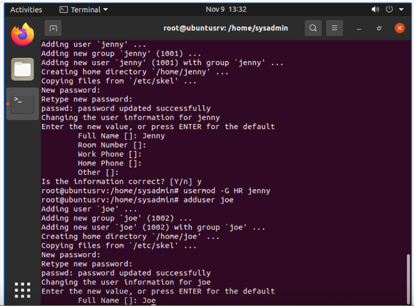
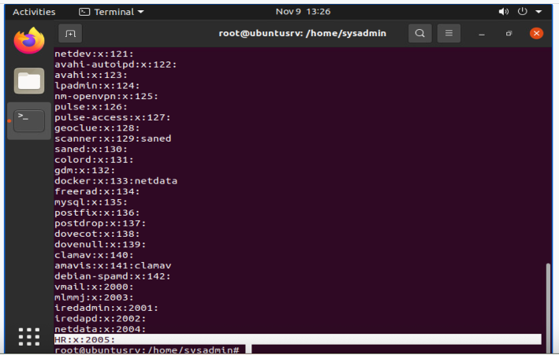
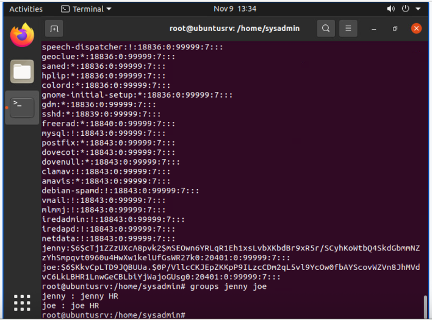
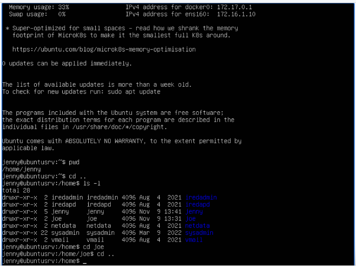
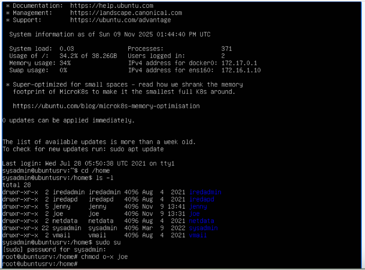
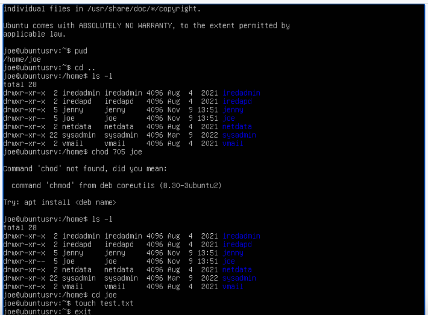
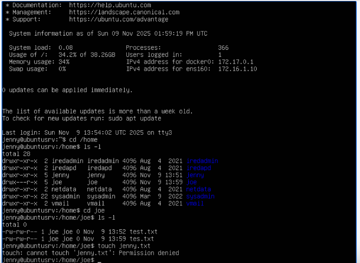

# Linux Permissions & Access Control Lab

## Overview
In this lab, I worked with Linux user accounts, groups, and file permissions to understand how access control is enforced on a system. I created users, assigned group memberships, and tested how permissions affect access to files and directories.

## Objective
- Create and manage Linux users and groups
- Understand how permissions control access
- Test access between different users
- Apply least privilege concepts

## Lab Environment
- Ubuntu Server
- Linux Command Line

---

## Actions Performed

### 1. User and Group Creation
I created two users (`jenny` and `joe`) and added them to a group called `HR`.

📸 Evidence:  

**What this shows:**  
Creation of user accounts and assignment to a group using Linux commands.

**Why this matters for SOC:**  
SOC analysts often investigate unauthorized account creation. Understanding how accounts are created helps identify suspicious users and potential persistence mechanisms used by attackers.

---

### 2. Verifying Account Information
I confirmed user and group configuration using system files and commands:
- `/etc/passwd`
- `/etc/group`
- `/etc/shadow`
- `groups`

📸 Evidence:  
  
  

**What this shows:**  
Verification of user accounts, group membership, and password storage locations within Linux.

**Why this matters for SOC:**  
These files are critical during investigations. Analysts use them to detect:
- Unauthorized users
- Privilege escalation
- Suspicious group assignments

---

### 3. Testing Directory Access (Before Restriction)
I tested access between users by attempting to view and navigate directories before applying restrictions.

📸 Evidence:  

**What this shows:**  
A user (jenny) accessing system directories and viewing other users’ folders.

**Why this matters for SOC:**  
Establishing a baseline is critical. Analysts need to understand what normal access looks like before identifying abnormal or unauthorized behavior.

---

### 4. Restricting Permissions
I removed execute permission for others using `chmod` to prevent unauthorized directory access.

📸 Evidence:  

**What this shows:**  
Modification of file permissions using `chmod` to enforce access control.

**Why this matters for SOC:**  
Permission changes can indicate:
- Security hardening (good)
- Malicious activity (bad)

SOC analysts monitor permission changes to detect attackers trying to hide files or restrict access.

---

### 5. Numeric Permissions (chmod 705)
I applied numeric permissions to control access levels and tested allowed actions.

📸 Evidence:  

**What this shows:**  
Use of numeric permission values to define access levels for owner, group, and others.

**Why this matters for SOC:**  
Understanding permission structures helps analysts identify:
- Misconfigurations
- Overly permissive access
- Security weaknesses attackers can exploit

---

### 6. Validating Access Control (Access Denied)
I verified that unauthorized users could no longer perform restricted actions.

📸 Evidence:  

**What this shows:**  
A user attempting an action and receiving a “Permission denied” error.

**Why this matters for SOC:**  
This confirms that security controls are working. SOC analysts must validate that protections are effective and preventing unauthorized activity.

---

## Key Concepts Demonstrated
- Linux file permissions (read, write, execute)
- User and group management
- Least privilege enforcement
- Access validation testing

---

## SOC Analyst Relevance
This lab reflects real-world security practices where analysts:
- Investigate user account activity
- Monitor permission changes
- Detect unauthorized access attempts
- Validate access control mechanisms

---

## What I Learned
This lab helped me understand how Linux enforces access control and how permissions directly impact system security. I practiced verifying access between users and applying changes to restrict unauthorized activity.
