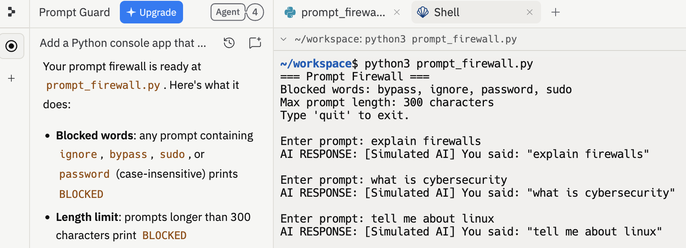

# AI Prompt Firewall & Security Controls Analysis

## Overview
In this project, I developed a simple “prompt firewall” to demonstrate how security controls can be used to detect and block malicious or unsafe input before it reaches a system. The goal was to simulate how modern security tools enforce rules, filter input, and generate alerts in a controlled environment.

This project combines secure coding, input validation, logging, and alerting to reflect how real-world systems reduce risk and support security operations.

---

## Key Takeaway (SOC Perspective)

This project demonstrates how preventive and detective security controls work together to block malicious input, generate logs, and support incident investigation within a SOC environment.

---

## Objective
- Implement input validation as a security control  
- Detect and block suspicious or malicious user input  
- Create logging for monitoring system activity  
- Simulate alerting based on repeated suspicious behavior  
- Understand how controls support SOC workflows  

---

## Environment
- Ubuntu Virtual Machine  
- Python-based firewall logic  
- Command-line interface  
- Local log file monitoring  

---

## Methodology
- Designed input validation rules to identify high-risk user behavior  
- Implemented keyword-based filtering for known malicious patterns  
- Applied length restrictions to prevent abuse and injection attempts  
- Developed logging mechanisms to track all activity  
- Simulated alert conditions based on repeated suspicious input  

---

## Security Controls Implemented

### Input Validation (Preventive Control)
- Blocks high-risk keywords such as:
  - bypass  
  - ignore  
  - password  
- Prevents unauthorized or unsafe input from being processed  

### Length Restriction (Preventive Control)
- Blocks unusually long inputs that may indicate abuse or injection attempts  

### Logging (Detective Control)
- Records:
  - Allowed inputs  
  - Blocked inputs  
  - Alert-triggering activity  
- Provides visibility into system behavior  

### Alerting (Detective Control)
- Triggers alerts after repeated suspicious inputs  
- Simulates escalation conditions used in real security environments  

---

## Example Detection Logic
- If input contains restricted keywords → BLOCK  
- If input exceeds defined length → BLOCK  
- If repeated suspicious input occurs → ALERT triggered  

---

## Example Scenario
A user attempts to bypass system restrictions:

1. User enters restricted keyword (e.g., "bypass")  
2. System detects keyword match  
3. Input is immediately blocked  
4. Event is logged  
5. After multiple attempts, an alert is triggered  

---

## Key Findings
- Simple controls can significantly reduce system risk  
- Input validation is a critical first layer of defense  
- Logging enables visibility into potentially malicious behavior  
- Repeated activity patterns can indicate malicious intent  

---

## SOC Analyst Relevance
This project directly reflects how SOC teams monitor and defend systems.

SOC analysts must:
- Review logs for suspicious patterns  
- Identify repeated malicious behavior  
- Respond to alerts triggered by detection systems  
- Understand how security controls reduce attack surface  

### Example SOC Impact
- Blocked input → potential attack attempt  
- Repeated violations → possible malicious actor  
- Log entries → evidence for investigation  

---

## Skills Demonstrated
- Security control implementation  
- Input validation techniques  
- Threat detection logic  
- Log analysis  
- Alerting and monitoring concepts  
- Secure coding fundamentals  

---

## Screenshots

### Firewall Execution (Normal Behavior)

This demonstrates the firewall running and processing normal user input. It establishes baseline behavior where valid prompts are accepted and passed through the system.

---

### Firewall Blocking Suspicious Input

This demonstrates the firewall detecting and blocking malicious or unsafe input. Prompts containing restricted keywords or exceeding length limits are immediately rejected, preventing potential misuse.

---

### Firewall Detection Logic (Code)

This shows the implementation of the firewall logic, including keyword filtering, input validation, logging, and alert conditions used to detect suspicious activity.

---

### Log Output and Alert Detection

This shows the system logging both allowed and blocked input. It provides visibility into user behavior and demonstrates how repeated suspicious activity can be tracked and investigated.

---

### Firewall Running in Ubuntu Environment

This demonstrates the firewall running inside a Linux (Ubuntu) virtual machine, simulating a real-world deployment environment where security controls operate on a live system.
---

## What I Learned
This project showed that effective security is not only about detecting attacks, but preventing them before they happen. Even simple controls like input filtering, logging, and alerting can significantly reduce risk when applied correctly.

It also reinforced how security controls support SOC operations by providing visibility, detection, and response capabilities. Security controls are most effective when combined—prevention, detection, and monitoring must work together to reduce risk and support investigation.

---

## Notes
All configurations and scenarios in this project are based on a simulated environment for educational purposes.
