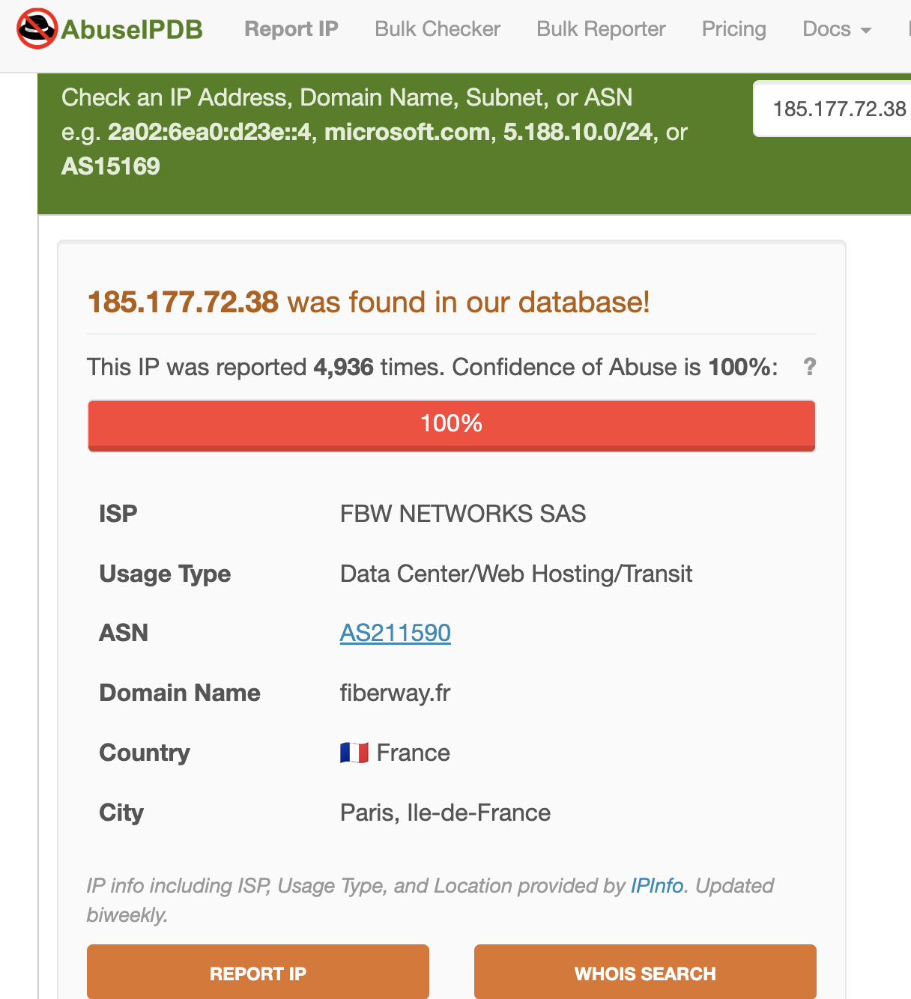

# Wordfence Alert Investigation

## Overview
In this project, I investigated a firewall alert showing a high volume of blocked requests. The goal was to understand how alerts appear in real environments and how analysts perform initial triage and threat validation.

---

## Objective
- Analyze firewall alert behavior  
- Identify suspicious traffic patterns  
- Investigate IP reputation  
- Practice basic SOC investigation workflow  

---

## Environment
- Simulated WordPress security environment  
- Wordfence Web Application Firewall (WAF)  
- External threat intelligence platforms  

---

## Tools Used
- Wordfence  
- AbuseIPDB  
- VirusTotal  
- WHOIS Lookup  

---

## Methodology
1. Reviewed firewall alert indicating repeated blocked requests  
2. Identified patterns in inbound traffic behavior  
3. Investigated IP reputation using AbuseIPDB  
4. Cross-referenced findings with VirusTotal and WHOIS  
5. Documented results and assessed potential threat level  

---

## Evidence

### Wordfence Alert Output

This screenshot shows the firewall detecting and blocking repeated inbound requests, indicating automated activity.

---

### IP Reputation Analysis (AbuseIPDB)

The IP was flagged with a high abuse confidence score, confirming a history of malicious behavior.

---

## Analysis
The repeated high-frequency requests indicate automated scanning behavior commonly used by attackers to identify vulnerabilities.  

Threat intelligence data confirms that the IP has been associated with malicious activity across multiple reports.  

Additionally, while geolocation data suggests a specific country, this does not reliably identify the attacker due to the use of VPNs and hosting infrastructure.

---

## Key Findings
- High-volume requests suggest automated scanning or probing  
- IP reputation confirms malicious activity  
- Firewall successfully blocked incoming threats  
- Location data alone is not a reliable attribution method  

---

## SOC Analyst Relevance
This project reflects the early stages of SOC investigation and alert triage.

SOC analysts must:
- Validate alerts generated by security tools  
- Identify patterns in suspicious traffic  
- Use threat intelligence platforms to assess risk  
- Determine whether activity requires escalation  

### Example SOC Impact
- Repeated blocked requests → possible reconnaissance activity  
- High abuse score → confirmed malicious source  
- Firewall logs → evidence for investigation  

---

## Skills Demonstrated
- Alert triage  
- Threat intelligence analysis  
- Pattern recognition  
- Basic investigation workflow  
- Cybersecurity documentation  

---

## What I Learned
This project helped me understand how security alerts are generated and how analysts begin investigating suspicious activity. It reinforced the importance of combining firewall data with threat intelligence to validate potential threats.

---

## Notes
All scenarios and data in this project are based on a simulated environment for educational purposes.
