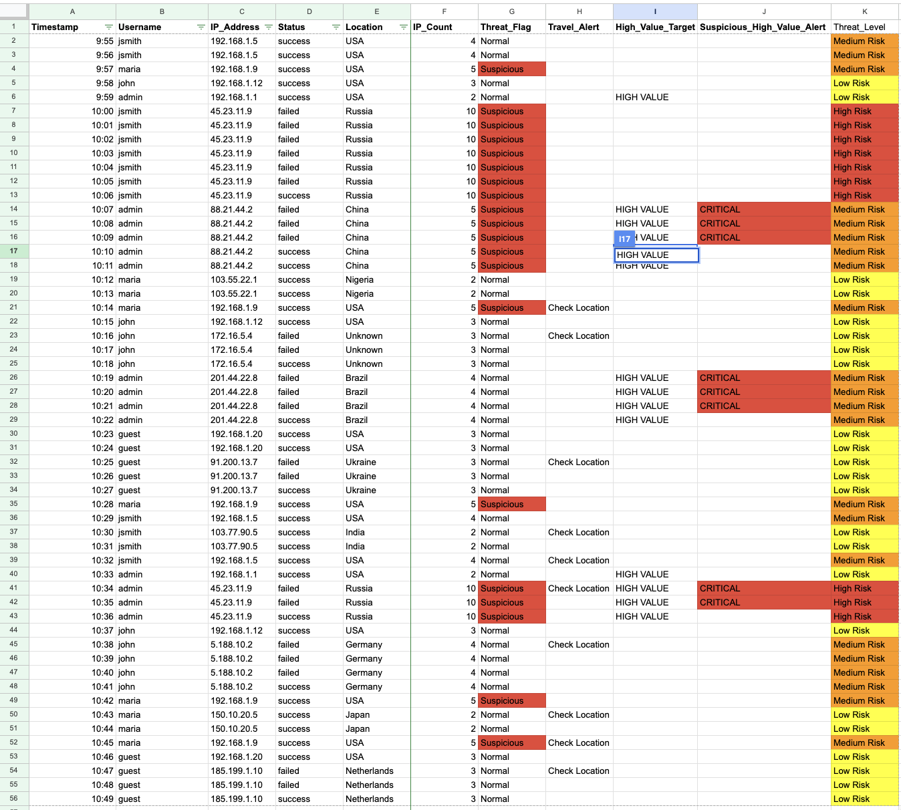

<h1 align="center">Cybersecurity Investigations Portfolio</h1>

<p align="center">
  Threat Intelligence • Log Analysis • Incident Response • MITRE ATT&CK
</p>

<p align="center">
  
  
  
  
</p>

<p align="center">
  <a href="#-overview">Overview</a> •
  <a href="#-ip-reputation-analysis">IP Analysis</a> •
  <a href="#-simulated-log-analysis-system">Log Analysis</a> •
  <a href="#-mitre-attck-mapping">MITRE ATT&CK</a> •
  <a href="#-screenshots">Screenshots</a>
</p>

---

## Overview

This portfolio showcases hands-on cybersecurity work focused on threat intelligence and log analysis. These projects simulate real-world workflows used in a Security Operations Center (SOC) environment.

The objective is to demonstrate the ability to:
- Investigate suspicious indicators  
- Analyze login behavior  
- Detect attack patterns  
- Classify risk levels  
- Apply cybersecurity frameworks  

---

## IP Reputation Analysis

<details>
<summary><strong>Click to Expand</strong></summary>

<br>

### Objective
Investigate a suspicious IP address using a threat intelligence platform.

---

### Key Findings
- IP Address: 185.177.72.38  
- Confidence of Abuse: 100%  
- Reports: 4,936  
- Location: France  
- Usage Type: Data Center / Hosting  

---

### Analysis
The IP shows strong indicators of malicious activity based on extremely high abuse reports and hosting infrastructure commonly used in automated attacks such as scanning and brute force attempts.

---

### Skills Demonstrated
- Threat Intelligence Analysis  
- IP Reputation Research  
- Risk Assessment  
- Cybersecurity Documentation  

</details>

---

## Simulated Log Analysis System

<details>
<summary><strong>Click to Expand</strong></summary>

<br>

### Objective
Simulate SOC analyst workflows by detecting suspicious login activity.

---

### What Was Built
- IP repetition detection using COUNTIF  
- Threat classification (Normal / Suspicious)  
- Impossible travel detection  
- High-value account monitoring  
- Risk scoring (Low / Medium / High)  
- Conditional formatting for visual alerting  

---

### Threats Identified
- Brute force attacks  
- Account compromise  
- Suspicious login patterns  
- Privileged account targeting  
- Geographic anomalies  

---

### Detection Logic

**Threat Flag**
```excel
=ARRAYFORMULA(IF(A2:A="", "", IF(F2:F>4,"Suspicious","Normal")))
</details>

---

### 🛠️ Skills Demonstrated
- Log Analysis  
- Pattern Recognition  
- Threat Detection  
- Risk Classification  
- SOC-style Alert Triage  
- Behavioral Analysis  

</details>

---

## ━━━━━━━━━━━━━━━━━━━━━━━
## 🧠 MITRE ATT&CK Mapping

| Behavior | Detection Focus | MITRE ATT&CK Mapping |
|--------|----------------|----------------------|
| Repeated failed logins | Password guessing activity | Brute Force |
| Admin account targeting | Privileged account abuse | Privilege Abuse |
| Success after failures | Credential compromise | Initial Access |
| Location anomalies | Suspicious login behavior | Account Compromise |
| Repeated IP activity | Automated attack patterns | Reconnaissance |

---

## ━━━━━━━━━━━━━━━━━━━━━━━
## 📸 Screenshots

<p align="center">
  
  
</p>

---

## ━━━━━━━━━━━━━━━━━━━━━━━
## 🏆 Key Takeaway

> Attackers rely on staying hidden.  
> Cybersecurity professionals exist to find what others can’t see.
